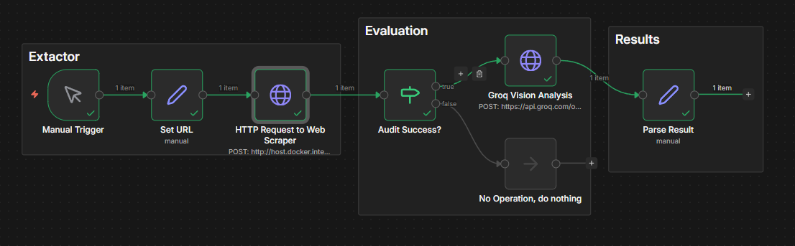

# 🦷 Website Audit Analyzer

An automated website auditing system for digital marketing agencies. Scrapes any website, extracts technical signals, captures screenshots, and sends everything to Groq Vision AI for scoring and recommendations.

**FastAPI + Playwright + Groq Vision AI + n8n**

---

## How It Works

```
URL → Headless Browser → Extract Signals + Screenshots → Groq AI → Scores & Recommendations
```



1. You paste a URL into n8n
2. The scraper opens the site in Chromium, extracts 11 technical signals and 3 screenshots
3. n8n sends that data to Groq Vision AI
4. AI returns scores (0-100), top issues, and a pitch recommendation

---

## Setup

```bash
git clone https://github.com/yourusername/web-scraper.git
cd web-scraper
python -m venv venv
venv\Scripts\activate
pip install -r requirements.txt
playwright install chromium
```

Start the server:

```bash
python run.py
```

Test it:

```bash
curl -X POST http://localhost:8000/analyze -H "Content-Type: application/json" -d '{"url": "https://example.com"}'
```

Or visit `http://localhost:8000/docs` for the Swagger UI.

---

## What It Extracts

| Signal | Description |
|--------|-------------|
| SSL, viewport meta, meta description | Basic SEO & mobile readiness |
| CTA count, contact form, phone, email | Conversion signals |
| Navigation items, structured data | Site structure & schema markup |
| Page load time | Performance |
| 3 screenshots (hero, mid, footer) | Visual design for AI scoring |

---

## AI Output

```json
{
  "overall_score": 70,
  "design_score": 60,
  "functionality_score": 80,
  "seo_score": 80,
  "mobile_readiness": 80,
  "summary": "Clean design but lacks clear CTAs and meta descriptions.",
  "top_issues": ["No CTAs", "Missing meta description", "Too many nav items"],
  "recommendation": "Add prominent CTAs and meta descriptions to improve conversions."
}
```

---

## Project Structure

```
web-scraper/
├── app/
│   ├── main.py              # FastAPI app & /analyze endpoint
│   ├── config.py            # All settings in one place
│   ├── models.py            # Request/response validation
│   └── core/
│       ├── browser_manager.py   # Chromium lifecycle & health checks
│       ├── analyzer.py          # Audit orchestrator with retries
│       ├── dom_extractor.py     # 11 technical signals via JS
│       └── screenshotter.py     # 3 viewport screenshots
├── run.py
├── requirements.txt
└── README.md
```

---

## n8n Workflow

| Node | What It Does |
|------|-------------|
| **Set URL** | Paste the website URL |
| **Scrape Website** | `POST http://localhost:8000/analyze` with the URL |
| **Audit Success?** | Routes success to Groq, failures to no-op |
| **Groq Vision Analysis** | Sends signals + screenshots to AI for scoring |
| **Parse Results** | Extracts clean JSON with scores and recommendations |

> If n8n runs in Docker, use `http://host.docker.internal:8000/analyze` instead of `localhost`.

---

## Tech Stack

FastAPI · Uvicorn · Playwright · Pillow · Pydantic · Groq API · n8n

---

## License

MIT